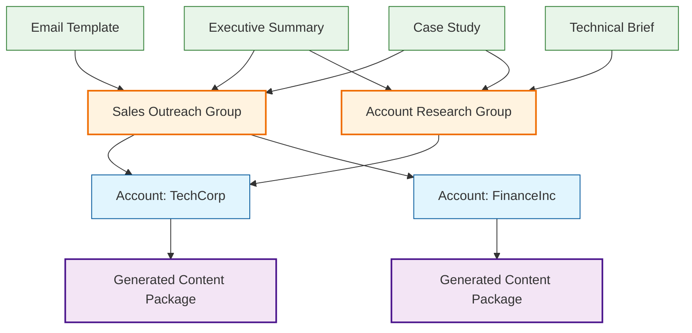

Content Groups let you bundle multiple content templates together so they can be applied to accounts as a unified collection. This streamlines content generation by creating relevant messaging for different stakeholders and use cases in one action.

<Info>
Content Groups determine which personalized content gets generated when applied to an account. Well-organized groups ensure you create comprehensive messaging that covers all key stakeholders and use cases for each target account.
</Info>

## How It Works

Content Groups consist of multiple content templates that work together:
- **Template Collections** - Multiple templates bundled for comprehensive account coverage
- **Unified Generation** - All templates in a group generate content simultaneously  
- **Role-Based Organization** - Group templates by stakeholder type, use case, or sales motion
- **Workflow Integration** - Groups can be included in automated account onboarding workflows

## Template Organization Flow

## Creating Content Groups

<Steps>
  <Step title="Name your group">
    Use descriptive names like "Enterprise Outreach", "Technical Evaluation", or "Executive Briefing"
  </Step>
  <Step title="Select language">
    Choose the primary language for all content in this group
  </Step>
  <Step title="Add templates">
    Select multiple templates that work together for your specific use case
  </Step>
  <Step title="Test the group">
    Apply to a known account to verify all templates generate appropriate content
  </Step>
  <Step title="Save and organize">
    Save the group and consider adding to relevant workflows
  </Step>
</Steps>

## Effective Group Organization

### **By Stakeholder Type**
- **Executive Group** - CEO email, board summary, strategic overview
- **Technical Group** - Architecture brief, technical comparison, integration guide  
- **Procurement Group** - ROI analysis, vendor comparison, compliance summary

### **By Sales Motion**
- **New Logo Group** - Discovery email, company research, competitive positioning
- **Expansion Group** - Usage analysis, additional use cases, success metrics
- **Renewal Group** - Value summary, usage trends, optimization opportunities

### **By Industry Focus**
- **Financial Services Group** - Compliance brief, security overview, regulatory summary
- **Healthcare Group** - HIPAA compliance, patient outcomes, integration capabilities
- **Manufacturing Group** - Operational efficiency, supply chain, automation benefits

<Warning>
Keep groups focused on specific outcomes. Groups with too many unrelated templates create content overload and dilute messaging effectiveness.
</Warning>

## Group Management Best Practices

### **Template Relationships**
- Ensure templates complement rather than duplicate each other
- Maintain consistent tone and messaging across group templates
- Consider the logical flow of content consumption

### **Account Application**
- Apply groups that match account characteristics and sales stage
- Review generated content before sending to ensure quality and relevance
- Customize generated content to add specific account details

### **Performance Optimization**
- Track which groups generate the highest engagement
- A/B test different template combinations within groups
- Regular review and update of group composition based on results

## Common Group Configurations

**Comprehensive Account Research:**
- Executive Summary Template
- Strategic Priorities Analysis  
- Competitive Landscape Brief
- Key Stakeholder Mapping

**Multi-Touch Email Campaign:**
- Initial Outreach Email
- Technical Follow-up Email
- Executive Value Email
- Case Study Reference Email

**Meeting Preparation Package:**
- Account Intelligence Summary
- Talking Points Template
- Discovery Questions Template
- Competitive Battlecard

## Quick Actions

<CardGroup cols={3}>
  <Card title="Create Content Group" icon="folder-plus" href="/settings/content-groups">
    Build new template collections
  </Card>
  <Card title="Manage Templates" icon="edit" href="/settings/content-templates">
    Create and modify individual templates
  </Card>
  <Card title="Apply to Accounts" icon="rocket" href="/account-intelligence/content">
    Generate content using groups
  </Card>
</CardGroup>

## Integration with Workflows

Content Groups integrate with [Workflows](/workflows) to automate content generation during account onboarding. When you add a new company, selected Content Groups automatically generate their full template collection, ensuring consistent account preparation across your team.

Groups can also be applied manually to existing accounts when you need comprehensive content for specific sales activities or stakeholder meetings.