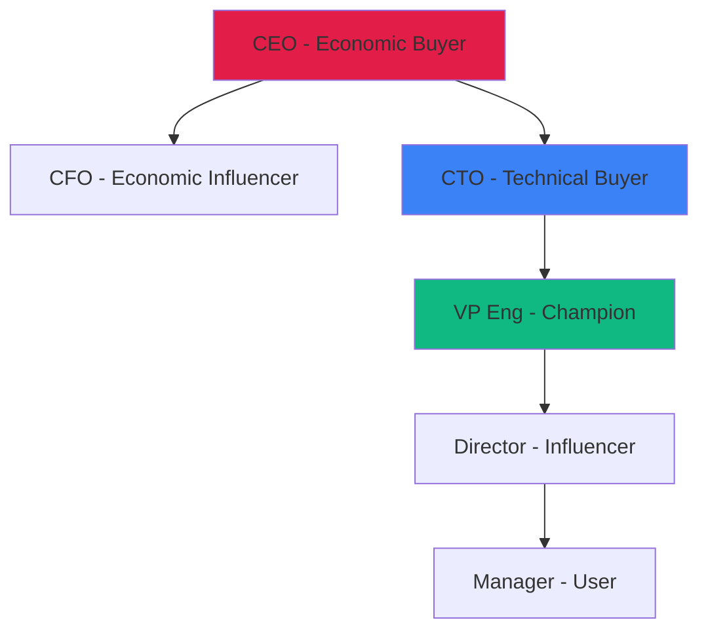

<Frame caption="The average B2B deal involves 6.8 decision makers - find them all">
  
</Frame>

## Contact Intelligence

<CardGroup cols={2}>
  <Card title="Decision Makers" icon="crown" color="#7c3aed">
    Budget authority and final approval power
  </Card>
  <Card title="Influencers" icon="users" color="#3b82f6">
    Technical evaluators and trusted advisors
  </Card>
  <Card title="Champions" icon="heart" color="#ef4444">
    Internal advocates who benefit from your solution
  </Card>
  <Card title="Blockers" icon="shield-xmark" color="#f59e0b">
    Stakeholders who might resist change
  </Card>
</CardGroup>

## Stakeholder Profiles

<Tabs>
  <Tab title="👔 Executives">
    **C-Suite & VPs**

    <Table>
  <TableHeader>
    <TableRow>
      <TableCell>Role</TableCell>
      <TableCell>Cares About</TableCell>
      <TableCell>Messaging</TableCell>
    </TableRow>
  </TableHeader>

  <TableBody>
    <TableRow>
      <TableCell>CEO</TableCell>
      <TableCell>Growth, competitive advantage</TableCell>
      <TableCell>Strategic outcomes</TableCell>
    </TableRow>

    <TableRow>
      <TableCell>CFO</TableCell>
      <TableCell>ROI, cost control, risk</TableCell>
      <TableCell>Financial impact</TableCell>
    </TableRow>

    <TableRow>
      <TableCell>CTO/CIO</TableCell>
      <TableCell>Innovation, architecture, scale</TableCell>
      <TableCell>Technical vision</TableCell>
    </TableRow>
  </TableBody>
</Table>
  </Tab>
  <Tab title="🛠️ Technical">
    **Architects & Engineers**

    <Info>
      Technical stakeholders can make or break your deal - they evaluate feasibility
    </Info>
    - System Architects
    - Lead Engineers
    - DevOps Leaders
    - Security Teams
  </Tab>
  <Tab title="💼 Business">
    **Line of Business Leaders**

    <Warning>
      Often the actual buyers with budget and pain points
    </Warning>
    - VP Operations
    - Head of Product
    - Director of Customer Success
    - Business Unit Leaders
  </Tab>
</Tabs>

## Multi-Threading Strategy

<Steps>
  <Step title="Map the Committee">
    Identify all stakeholders involved in the decision
  </Step>
  <Step title="Assign Relationships">
    Match your team members to appropriate contacts
  </Step>
  <Step title="Coordinate Outreach">
    Align messaging while personalizing approach
  </Step>
  <Step title="Track Engagement">
    Monitor who's engaged vs. who's silent
  </Step>
</Steps>

## Contact Insights Include

<AccordionGroup>
  <Accordion title="Professional Background" icon="id-card">
    - Current role and tenure
    - Previous positions
    - Areas of responsibility
    - Public statements/quotes
  </Accordion>
  <Accordion title="Strategic Focus" icon="bullseye">
    - Initiatives they own
    - Challenges they face
    - Success metrics
    - Budget authority
  </Accordion>
  <Accordion title="Engagement Guidance" icon="comments">
    - Best approach angle
    - Relevant peer examples
    - Pain points to explore
    - Value props that resonate
  </Accordion>
</AccordionGroup>

## Power Mapping Template

