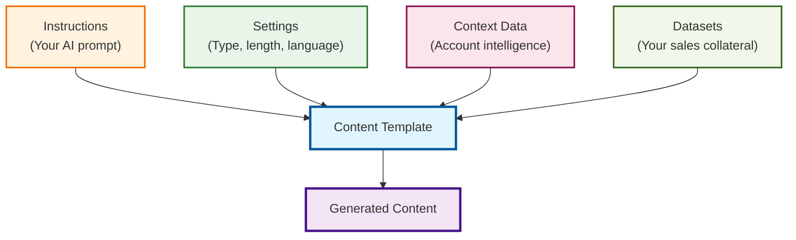

Content Templates are AI-powered instructions that generate personalized content for your target accounts. Each template combines your messaging requirements with account-specific intelligence to create relevant, customized communication.

<Info>
Content Templates use account intelligence, contact insights, and your business context to generate personalized messaging. Well-crafted templates produce content that feels researched and relevant rather than generic or templated.
</Info>

## How Templates Work

Templates combine multiple inputs to generate personalized content:
- **Instructions** - Your prompt that defines what content to create and how
- **Content Settings** - Format, length, and language specifications  
- **Context Data** - Account intelligence that personalizes the content
- **Datasets** - Your business information and sales collateral
- **Contact Information** - Individual insights when generating person-specific content

## Template Component Architecture



## Creating Content Templates

<Steps>
  <Step title="Access template creation">
    Navigate to Settings → Content Templates and click "New Template"
  </Step>
  <Step title="Write template instructions">
    Create specific, detailed instructions for the AI about what content to generate
  </Step>
  <Step title="Configure content settings">
    Set content type (email/document/notes), word count, and language
  </Step>
  <Step title="Select context data">
    Choose which account intelligence to include in content generation
  </Step>
  <Step title="Choose datasets">
    Select relevant business information and sales collateral
  </Step>
  <Step title="Test and refine">
    Generate sample content on known accounts and iterate on the template
  </Step>
</Steps>

## Writing Effective Template Instructions

### **Instruction Structure**
Your template instructions should include:

**Context Setting:**
```
You are writing [content type] from a salesperson at [Your Company] 
to a [recipient role] at [Company Name] with the goal of [objective].
```

**Content Requirements:**
```
The [email/document] should:
- [Specific requirement 1]
- [Specific requirement 2] 
- [Specific requirement 3]
```

**Format Specifications:**
```
Follow this structure:
- [Opening approach]
- [Body content guidelines]
- [Closing/call to action]
```

### **Effective Instruction Examples**

**Personalized Outreach Email:**
```
You are writing an email from a salesperson at [Company] to a [Role] at [Company Name] 
with the goal of booking a meeting to explore how [Solution] can help the company.

The email should:
- Reference a specific strategic initiative or challenge from their context data
- Include relevant proof point or case study
- Present a clear, low-friction meeting request
- Maintain professional but conversational tone

Follow this format:
- Great to see [specific company insight]
- [Relevant business challenge/opportunity] 
- [Your solution's value proposition with proof]
- [Clear call to action]
```

**Executive Summary:**
```
Create an executive summary for [Company Name] analyzing their strategic position 
and challenges that [Your Solution] addresses.

Include:
- 3-5 key strategic priorities from context data
- Relevant market trends affecting their industry
- Specific challenges your solution addresses
- 2-3 comparable companies who've achieved success

Structure as:
- Executive overview (2-3 sentences)
- Strategic priorities and challenges
- Solution alignment and value proposition  
- Next steps recommendation
```

**Technical Brief:**
```
Write a technical brief for [Role] at [Company Name] explaining how [Solution] 
integrates with their current technology stack.

Focus on:
- Technical requirements mentioned in context data
- Integration capabilities relevant to their industry
- Security and compliance considerations
- Implementation timeline and support

Format:
- Technical overview
- Integration approach  
- Security and compliance
- Implementation roadmap
```

<Warning>
Avoid overly generic instructions like "write a good email" or "tell them about our product." Specific, detailed instructions produce higher-quality, more personalized content.
</Warning>

## Content Settings Configuration

### **Content Type Options**
- **Email** - Optimized for email communication with appropriate formatting
- **Document** - Longer-form content suitable for attachments or presentations
- **Notes** - Internal use content like meeting preparation or account research

### **Word Count Guidelines**
- **50-125 words** - Cold outreach emails, brief updates
- **125-250 words** - Follow-up emails, meeting requests  
- **250-500 words** - Executive summaries, technical briefs
- **500+ words** - Comprehensive documents, detailed analyses

### **Language Selection**
- Choose target language for content generation
- Ensure context data and datasets support selected language
- Consider regional business communication preferences

## Context Data Selection Strategy

### **Value Pyramid**
- **Best for:** Executive-level content, strategic discussions
- **Contains:** Core business priorities and challenges
- **Use when:** Creating C-suite messaging or strategic proposals

### **Strategic Priorities**  
- **Best for:** Aligning with company initiatives
- **Contains:** Current business goals and focus areas
- **Use when:** Referencing specific company directions or investments

### **Three Whys**
- **Best for:** Consultative, insight-driven content
- **Contains:** Deep strategic reasoning behind company decisions
- **Use when:** Creating thought leadership or strategic advisory content

### **Website Content**
- **Best for:** Understanding company voice and positioning
- **Contains:** Public company messaging and stated priorities
- **Use when:** Aligning with company's own language and themes

### **Professional Experience** (Contact-specific)
- **Best for:** Personalized individual outreach
- **Contains:** LinkedIn profile analysis matched against company context
- **Use when:** Creating contact-specific emails or meeting preparation

## Dataset Selection Best Practices

### **For Personalized Emails**
- Focus on most relevant datasets to avoid feature overload
- Include case studies and competitive differentiation
- Select industry-specific information when available

### **For Executive Content**
- Include strategic business information and ROI data
- Add industry trends and market intelligence
- Include executive-level case studies and references

### **For Technical Content**
- Select technical specifications and integration capabilities
- Include security and compliance information
- Add implementation guides and support documentation

## Template Performance Optimization

### **Content Quality Indicators**
✅ **High-Quality Generated Content:**
- References specific company information accurately
- Uses appropriate tone for target audience
- Includes relevant, specific value propositions
- Flows naturally without obvious AI-generated patterns

❌ **Low-Quality Generated Content:**
- Generic language that could apply to any company
- Incorrect or irrelevant company information
- Overly promotional or feature-heavy messaging
- Obvious template-like structure

### **Iterative Improvement Process**
1. **Generate test content** on 3-5 known accounts
2. **Evaluate relevance** and accuracy of generated content
3. **Refine instructions** based on output quality
4. **Adjust context data** selection if needed
5. **Test again** and repeat until satisfied with quality

## Template Categories

PG:AI supports five main template categories, each optimized for specific sales scenarios:

### **Email Templates**
- **Purpose:** Direct outreach and follow-up communication
- **Best for:** Initial contact, meeting requests, nurture sequences
- **Word count:** 50-150 words for optimal engagement
- **Key features:** High personalization, clear CTAs, mobile-optimized

### **Use Case Alignment Documents** 
- **Purpose:** Map customer strategies to your solution capabilities
- **Best for:** Pre-meeting preparation, proposal support
- **Word count:** 300-500 words
- **Key features:** Strategy analysis, capability matching, proof points

### **MEDDIC Pre-Meeting Documents**
- **Purpose:** Force Management framework analysis for target accounts  
- **Best for:** Enterprise sales preparation, executive meetings
- **Word count:** 400-600 words
- **Key features:** Strategic priorities, business problems, differentiated value

### **Command of the Message Documents**
- **Purpose:** Before/after scenario analysis using Force Management methodology
- **Best for:** Value-based selling, outcome-focused conversations
- **Word count:** 500-800 words  
- **Key features:** Problem/solution narrative, required capabilities, proof points

### **Pre-Meeting Hypothesis Documents**
- **Purpose:** Demonstrate business understanding before first meetings
- **Best for:** Discovery calls, initial executive meetings
- **Word count:** 300-500 words
- **Key features:** Strategic initiatives, technology programs, solution alignment

## Selecting the Right Template Type

**For Initial Outreach:** Start with Email Templates to book meetings, then use Pre-Meeting Hypothesis Documents to prepare

**For Enterprise Deals:** Use MEDDIC or Command of the Message Documents for comprehensive account analysis

**For Solution Mapping:** Use Case Alignment Documents work best when you need to connect customer strategies to capabilities

**For Executive Meetings:** Command of the Message Documents provide the most strategic, outcome-focused approach

## Quick Actions

<CardGroup cols={3}>
  <Card title="Create Template" icon="plus" href="/settings/content-templates">
    Build new content templates
  </Card>
  <Card title="Organize Groups" icon="folder" href="/settings/content-groups">
    Bundle templates into collections
  </Card>
  <Card title="Generate Content" icon="magic" href="/account-intelligence/content">
    Use templates on target accounts
  </Card>
</CardGroup>

## Integration with Content Groups

Individual templates work best when organized into [Content Groups](/content-groups) that address comprehensive use cases. A single template might be used across multiple groups, allowing you to reuse well-performing templates in different contexts while maintaining focused group purposes.

Templates can also be included in [Workflows](/workflows) for automated content generation during account onboarding, ensuring consistent messaging and research across all new accounts.