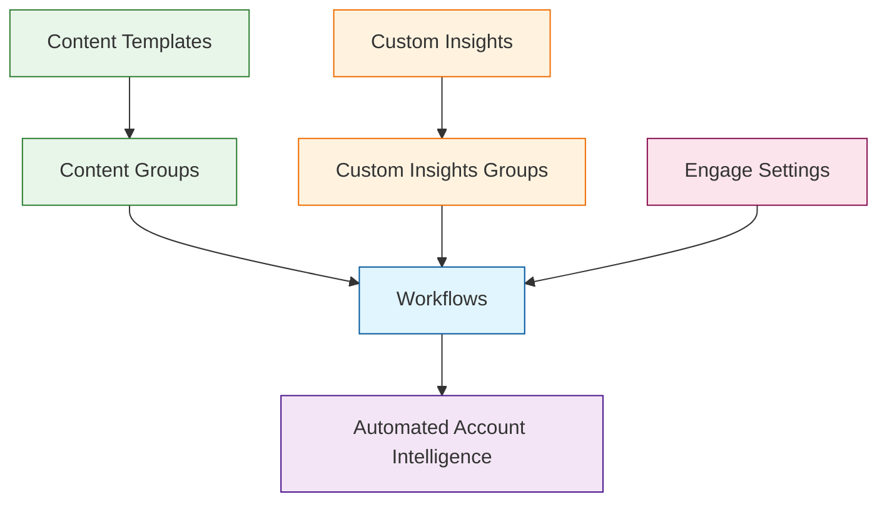

Workflows control what gets automatically generated when you add a company to PG:AI. They act as templates that ensure consistent account preparation across your team.

<Info>
  PG:AI includes a default "Platform Generated" workflow that provides a foundation for account onboarding. This serves as a starting point that you can modify or supplement with specialized workflows.
</Info>

## Workflow Architecture

## How Workflows Work

A workflow combines three components:

- **[Content Groups](/content-groups)** - Which personalized content gets created
- **[Custom Insights Groups](/custom-insights-groups)** - Which research queries are run
- **[Engage Settings](/engage-settings)** - Which value proposition framework is used

When you add a new company, PG:AI uses your selected workflow to automatically generate insights and content.

## Creating a Workflow

<Steps>
  <Step title="Name your workflow">
    Use descriptive names like "Enterprise FinServ" or "SMB Manufacturing"
  </Step>
  <Step title="Select Content Groups">
    Choose which content types to generate automatically
  </Step>
  <Step title="Choose Insights Groups">
    Pick which research queries to run for each account
  </Step>
  <Step title="Pick Engage Settings">
    Select your value proposition configuration
  </Step>
  <Step title="Test">
    Run on a known account to verify output quality
  </Step>
</Steps>

<Warning>
Start with 2-3 workflows maximum. You can always add more specialized workflows later as you identify specific patterns in your account types.
</Warning>

## When to Create Additional Workflows

Most companies only need one workflow. Create additional workflows if you want different intelligence for:

- Different industries (e.g., separate workflows for Financial Services vs Manufacturing)
- Different account types (e.g., Enterprise vs Mid-Market approaches)
- Different sales motions (e.g., New Logo vs Expansion plays)